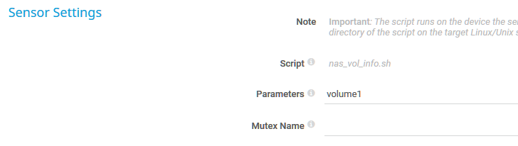
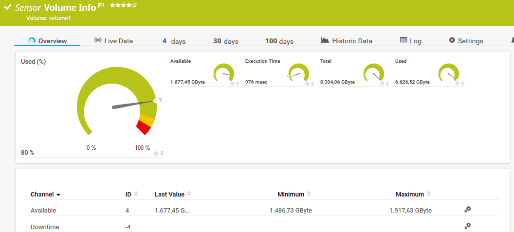
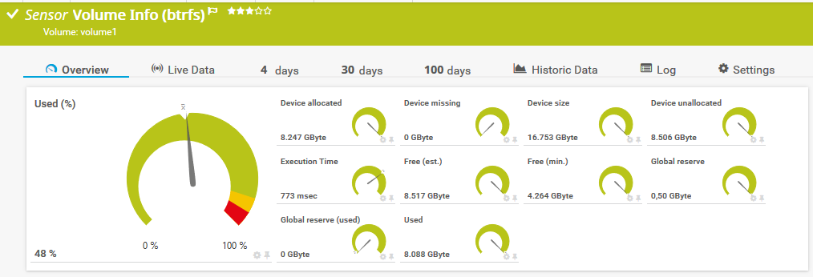

# nas_vol_info.sh

Bash script for PRTG by Paessler to monitor an entire volume on your Synology NAS

nas_vol_info_b.sh is especially for btrfs filesystem as I have learned that **df** deals not correct with some of the quirks of btrfs. This script uses therefore **btrfs filesystem usage** to get the data.

Sensor has to be created in PRTG on your Synology device.

Sensor tested on DS 918+ with DSM 6.2.4-25556 and 7.0-41890

HINT: The value ***Used (%)*** may differ from what DSM tell you. Maybe DSM use also **df**.

### Prerequisites

Be sure you have set correct logon values for SSH in your device.

I personally use "Login via private key" with an user especially for monitoring which also may use sudo for this script without a password.


**HINT:** Since DSM 6.2.2 for SSH access the user has to be member of the local Administrators group on your Synology NAS.

### Installing

Place the script to /var/prtg/scriptsxml on your Synology NAS and make it executable. (You may have to create this directory structure because PRTG expects the script here.)

```
wget https://raw.githubusercontent.com/WAdama/nas_vol_info/master/nas_vol_info.sh
or
wget https://raw.githubusercontent.com/WAdama/nas_vol_info/master/nas_vol_info_b.sh
chmod +x nas_vol_info.sh
```

In PRTG create under your device which represents your Synology a SSH custom advanced senor.

Choose under "Script" this script and enter under "Parameters" the name of the volume you want to monitor: e.g. volume1.



This script will set default values for limits in the Used (%) channel:

90% for Upper warning limit

95% for Upper error limit

Sensor nas_vol_info.sh:


Sensor nas_vol_info_b.sh:



